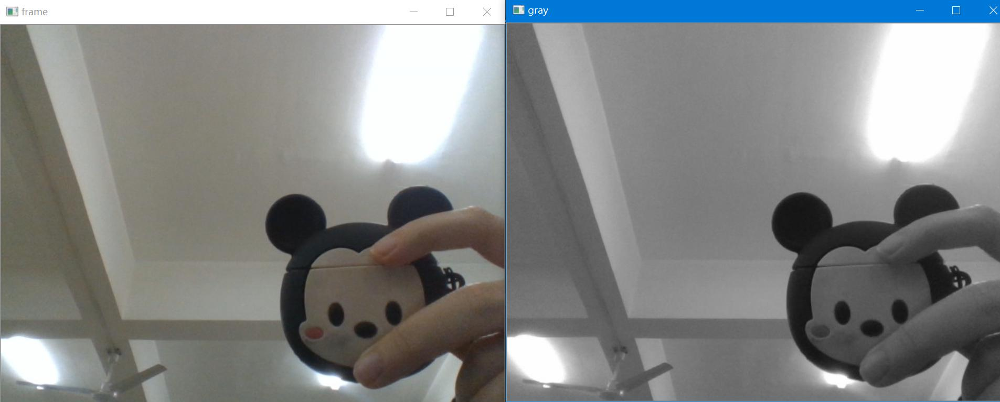

# -树莓派智能安防摄像头（Smart security camera for home use by Raspberry-Pi）

## -描述（Description）
		RPi-AI-Camera是一款智能AI摄像头，具有人形侦查预警器。
		通过识别移动的物体，抓取人脸图像对比家庭成员信息来判别出外人入侵的情况，从而做到邮件预警的功能
## -详细功能（detailed function）
 * 移动物体的追踪定位框选
 * 通过人脸识别技术，对非家庭成员入侵邮件预警预警
 * 实时录像以减轻内存负担
  
  **GitHub仓库：**  [yuaaaaaa/RPi-AI-CAMERA](https://github.com/yuaaaaaa/RPi-AI-CAMERA.git)
  
## -为什么使用树莓派（Why Raspberry Pi?）
树莓派是一个只有信用卡大小的微型电脑，可以完成各种任务，基于他体型小的特点，可以用于家用微型摄像仪的载体。
这款Linux系统的计算机可以在低耗的情况下完成各种预期功能。
[了解更多](https://baike.so.com/doc/6240059-6453436.html)
## - 如何使用（How to do）
### step1-准备工具（tool）
* **硬件设备**
 * 树莓派（Raspberry-Pi）
 * 树莓派搭载摄像头（Raspberry Pi camera module）
* **软件设备**
 * Python3
 * openCV

### step2-配置Raspberry Pi
* 确认openCV模块安装
```
进入Raspberry Pi命令界面
进入Python编译器 
>> python
测试opencv模块是否安装成功
>> import cv2
```
安装成功就可以进入下一步啦，如果出现了错误[点击这里](https://blog.csdn.net/kyokozan/article/details/79192646)
* 确认camera模块启动
```
// 尝试以下命令
ls -al /dev/ | grep video
// 当看到'video0 device'时表明摄像头模块已启动
```

### step3-测试相机
#### 现在让我们用树莓派拍一张照片吧~
```
// 拍摄一张照片 并命名为image.jpg存到本地
raspistill -o image.jpg
```
#### 现在让我们用一段简单的代码测试一下吧
首先打开你的树莓派编译器，然后输入以下代码
```py
import cv2
cap = cv2.VideoCapture(0)
# 设置窗口的宽和高
cap.set(3,640)
cap.set(4,480)
while(True):
    ret, frame = cap.read()
    if ret:
        gray = cv2.cvtColor(frame, cv2.COLOR_BGR2GRAY)
        cv2.imshow('frame', frame)
        cv2.imshow('gray', gray)
        k = cv2.waitKey(30) & 0xff
    if k == 27: # press 'ESC' to quit
        break
cap.release()
cv2.destroyAllWindows()
```
执行以上代码以后会出现两个运行窗口，frame和gray
在这里我们添加gray窗口是为了后续便于方便计算

### step4-移动物体目标检测
```python
# -*- coding: utf-8 -*-
"""
Created on Wed Nov 25 14:21:53 2020

@author: Administrator
"""

import cv2
import numpy as np
# import face_recognition
import os
path = "C://Users//Administrator//Desktop//项目实训//face_image"  # 模型数据图片目录
cap = cv2.VideoCapture(0)
total_image_name = []
total_face_encoding = []
for fn in os.listdir(path):  #fn 表示的是文件名q
    print(path + "/" + fn)
    fn = fn[:(len(fn) - 4)]  #截取图片名（这里应该把images文件中的图片名命名为为人物名）
    total_image_name.append(fn)  #图片名字列表

#读取视频流
cap = cv2.VideoCapture(0)
firstFrame = None
countflag = 0

if cap.isOpened():
    while(True):
        print('camera open')
        f1 = open('test.txt','w')
        f1.write('hello boy!')
        countflag += 1
        ret, frame = cap.read()
        #没有抓到第一帧那么说明到了视频结尾
        if not ret:
            break
        #调整帧的大小，转换为灰度图像进行高斯模糊
        framev = cv2.resize(frame, (640, 360))
        frame = cv2.resize(frame, (640, 360), interpolation=cv2.INTER_CUBIC)
        gray = cv2.cvtColor(frame, cv2.COLOR_BGR2GRAY)
        gray = cv2.GaussianBlur(gray, (21, 21), 0)
        #如果第一帧是None， 对其初始化
        if firstFrame is None:
            firstFrame = gray
            continue
        #计算当前帧与第一帧的不同
        frameDelta = cv2.absdiff(firstFrame, gray)
        thresh = cv2.threshold(frameDelta, 25, 255, cv2.THRESH_BINARY)[1]
        #扩展阀值图像填充孔洞
        thresh = cv2.dilate(thresh, None, iterations=3)
        contours, hierarchy = cv2.findContours(thresh.copy(), cv2.RETR_EXTERNAL, cv2.CHAIN_APPROX_SIMPLE)
        #遍历轮廓
        flag = 1
        for contour in contours:
            if cv2.contourArea(contour) < 1000: #面积阈值
                continue
            #计算最小外接矩形
            x, y, w, h = cv2.boundingRect(contour)
            cv2.rectangle(frame, (x, y), (x + w, y + h), (0, 255, 0), 2)
            if(flag):
                flag = 0
                # discern(framev)
            
        cv2.putText(frame, "F{}".format(frame), (20, 30), cv2.FONT_HERSHEY_SIMPLEX, 1, (0, 0, 255), 2)
        
        cv2.imshow('frame_with_result', frame)
        cv2.imshow('thresh', thresh)
        cv2.imshow('frameDiff', frameDelta)
        if(countflag == 50):
            countflag = 0
            firstFrame = gray
        #处理按键效果
        key = cv2.waitKey(60) & 0xff
        if key == 27:
            break
        elif key == ord(' '):
            cv2.waitKey(0)
        
    cap.release()
cv2.destroyAllWindows()
```
技术知识点：
### step5-pass待更新